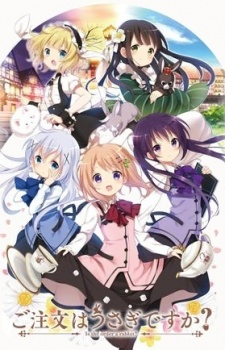

# DCP Logo Moe Moe Project

## Overview

The [**Human Cell Atlas**](https://www.humancellatlas.org/) (HCA) is an ambitious project to

> create comprehensive reference maps of all human cells—the fundamental units of life—as a basis for both understanding human health and diagnosing, monitoring, and treating disease.

This involves generating a lot of biological data from high-throughput genomics and imaging technologies.
Organization and analysis of HCA data is the responsibility of the [**Data Coordination Platform**](https://www.humancellatlas.org/data-sharing) (DCP).
The DCP implements a computational architecture for data processing, all the way from ingestion to exploration.

## Problem statement 

The current logo for the HCA is this rather boring image:

For the DCP itself, there is the snooze-inducing diagram here:

I also have a T-shirt where the parts of the HCA logo are colored using the box colors in the DCP schematic.

It's a nice shirt, but, all in all, I think we can agree that it's not very inspiring.

If I had one major criticism about these images, it's that they're not _moe_ enough.
By contrast, Kyoto City can make even public transport cute:

Our task here is to improve the DCP logo by making it more _moe_.
We want to search the ["literature"](https://myanimelist.net) for an anthropomorphized representation of each DCP box.
This requires a show with a main cast of five who have color-coded themes according to the DCP box colors above.
Obviously, we are looking for _moe_, which restricts the most likely genres to comedy or slice of life.

## Solution

For any serious anime watcher, the constraints above should immediately suggest one show in particular.
Yes, that's right - [**Gochuumon wa Usagi Desu ka?**](https://myanimelist.net/anime/21273/Gochuumon_wa_Usagi_Desu_ka) (GochiUsa), or "Is the Order a Rabbit?".

I shouldn't need to say more, but I will.
For the uninitiated, GochiUsa is a show about the day-to-day lives of several friends working in cafes in a small European-ish town.
It is a relaxing show - if very saccharine - and nothing bad ever happens, which makes it perfect for representing the DCP.
And if one season wasn't enough, there's [another](https://myanimelist.net/anime/29787/Gochuumon_wa_Usagi_Desu_ka)!

## Honorable mentions

[**Hanayamata**](https://myanimelist.net/anime/21681/Hanayamata) would be a good choice but for a better color distribution among its main characters.

[**Joshiraku**](https://myanimelist.net/anime/12679/Joshiraku) also has a main cast of five, but the colors don't quite fit.

## Contribute!

Please raise an issue if you find a show that fits our color-coding requirements.

**Specific comments:**

- No [**Madoka**](https://myanimelist.net/anime/9756/Mahou_Shoujo_Madoka%E2%98%85Magica).
Not only do the colours not fit, the tone of the show is not in line with my mental image of the DCP.
